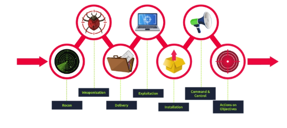

Let's walk through these attack phases to help you understand attacker methods and how to defend against them:

- Reconnaissance
- Weaponization
- Delivery
- Exploitation
- Installation
- Command & Control
- Actions on Objectives

## Reconnaissance

**Reconnaissance** is discovering and collecting information on the system and the victim. It's the planning stage for attackers.

**OSINT** (Open-Source Intelligence) is also part of reconnaissance. OSINT is the first step an attacker needs to complete to carry out the further phases of an attack. The attacker needs to study the victim by collecting every available piece of information on the company and its employees, such as the company's size, email addresses, phone numbers from publicly available resources to determine the best target for the attack. 

**Email harvesting** is the process of getting email addresses from public, paid, or free services. An attacker can use email-address harvesting for a **phishing attack** which is a type of social-engineering attack used to steal sensitive data, including login credentials and credit card numbers. 

 The attackers will have a big arsenal of recon tools available for reconnaissance purposes. Here are some of them:

- **theHarvester** - other than gathering emails, this tool is also capable of gathering names, subdomains, IPs, and URLs using multiple public data sources 
- **Hunter.io** - this is  an email hunting tool that will let you obtain contact information associated with the domain.
- **OSINT Framework** - OSINT Framework provides the collection of OSINT tools based on various categories.

**Knowledge Check:**

What is the name of the Intel Gathering Tool that is a web-based interface to the common tools and resources for open-source intelligence?

- OSINT Framework

What is the definition for the email gathering process during the stage of reconnaissance?

- Email harvesting

## Weaponization

Let's first define some terminology before we analyze the Weaponization phase.

- Malware is a program or software that is designed to damage, disrupt, or gain unauthorized access to a computer.
- An exploit is a program or a code that takes advantage of the vulnerability or flaw in the application or system.
- A payload is a malicious code that the attacker runs on the system.

In the Weaponization phase, the attacker might:
-  Make a harmful MS Office document with malicious macro scripts.
- Create a malicious payload or worm, put it on USB drives, and spread it around.
- Pick ways to control a victim's computer to run commands or send more payloads.

**Knowledge Check:**

This term is referred to as a group of commands that perform a specific task. You can think of them as subroutines or functions that contain the code that most users use to automate routine tasks. But malicious actors tend to use them for malicious purposes and include them in Microsoft Office documents. Can you provide the term for it? 

- Macro

## Delivery Phase

The delivery phase is when the attacker decides to choose the method for transmitting the payload or malware. Here are some choices:

- **Phishing email**: After recon,  the malicious actor would craft a malicious email that would target either a specific person (spearphishing attack) or multiple people in the company.
- **Infected USB drives**: Leaving USB drives with malware in places like coffee shops. Or, they might even mail fake gift USB drives with a company's logo on them. [CSO Online](https://www.csoonline.com/article/569163/cybercriminal-group-mails-malicious-usb-dongles-to-targeted-companies.html) has a story about USB attacks like this.
* **Watering hole attack**: This is a targeted attack designed to aim at a specific group of people by compromising the website they are usually visiting and then redirecting them to the malicious website of an attacker's choice. And from there people might end up downloading malware without even knowing, it is called drive-by download, like those fake pop-ups that ask you to download a browser extension.

**Knowledge Check:**

What is the name of the attack when it is performed against a specific group of people, and the attacker seeks to infect the website that the mentioned group of people is constantly visiting.

- Watering hole attack

## Exploitation

To get into the system, the attacker needs to exploit the vulnerability.  The attacker can send out two tricky phishing emails. One had a fake Office 365 login link, and the other had a file that, when opened, installed ransomware. He got two people to click and open them.

Once in, the attacker could use weaknesses in software or the system to gain more control or spread through the network.

These are examples of how an attacker carries out exploitation:
- The victim triggers the exploit by opening the email attachment or clicking on a malicious link.
- Using a zero-day exploit.
- Exploit software, hardware, or even human vulnerabilities. 
- An attacker triggers the exploit for server-based vulnerabilities. 

**Knowledge Check**

Can you provide the name for a cyberattack targeting a software vulnerability that is unknown to the antivirus or software vendors?

- Zero-day

## Installation

Once in, an attacker wants to keep that access, even if they get kicked out or the system gets fixed. That's where persistent backdoors come in. They let the attacker back in later.

Here's how they set it up:

- **Web Shells:** Putting sneaky code on the web server that's hard to spot.
- **Backdoor Install:** Using something like Meterpreter to plant a backdoor.
- **Messing with Windows Services:** Changing how Windows services work to run their code regularly.
- **Adding to Run Keys:** Making their code run every time someone logs in.

In this phase, the attacker can also use the **Timestomping** technique to avoid detection by the forensic investigator and also to make the malware appear as a part of a legitimate program. The Timestomping technique lets an attacker modify the file's timestamps, including the modify, access, create and change times. 

**Knowledge Check:**

Can you provide the technique used to modify file time attributes to hide new or changes to existing files?

- Timestomping

Can you name the malicious script planted by an attacker on the webserver to maintain access to the compromised system and enables the webserver to be accessed remotely?

- Web shell

## Command & Control

After getting persistence and executing the malware on the victim's machine, attackers would open up the C2 (Command and Control) channel through the malware to remotely control and manipulate the victim. This term is also known as **C&C or C2 Beaconing** as a type of malicious communication between a C&C server and malware on the infected host.

Until recently, IRC (Internet Relay Chat) was the traditional C2 channel used by attackers. This is no longer the case, as modern security solutions can easily detect malicious IRC traffic. 

Now, attackers usually use:

- Regular web traffic (HTTP on port 80 and HTTPS on port 443) to hide their activity.
- DNS (Domain Name Server). The infected machine keeps pinging the attacker's DNS server. This is DNS Tunneling.

**Knowledge Check:**

What is the C2 communication where the victim makes regular DNS requests to a DNS server and domain which belong to an attacker. 

- DNS Tunneling.

## Actions on Objectives 

After going through the six-stage attack, the goals come into play, focusing on the initial targets. Accessing the keyboard allows the attacker to:

* Grab user credentials.
* Exploit system flaws to get admin rights.
* Check out internal software for weaknesses.
* Move around the company's network.
* Steal important info.
* Erase backups.
* Mess up or wipe out data.

**Knowledge Check**

Can you provide a technology included in Microsoft Windows that can create backup copies or snapshots of files or volumes on the computer, even when they are in use? 

- Shadow copy

## Recap

If you've read this far, first of all, thank you! And if you're diving into cybersecurity, this breakdown offers a solid foundation to recognize and mitigate threats. 
