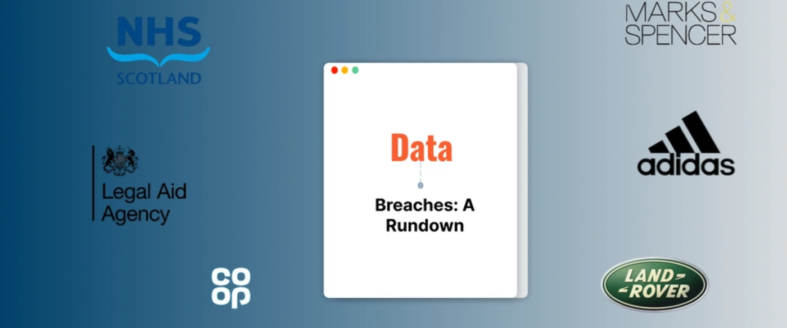

In 2025, UK businesses were hit by several cyberattacks that messed up operations and exposed private info. Here’s what happened:

### 1. NHS Scotland: 

In March 2025, NHS Scotland experienced a major cyberattack that caused network outages across multiple health boards, disrupting clinical systems and leading to delayed patient care. This incident raised concerns about fraud and extortion risks.

### 2. Jaguar Land Rover (JLR): 

On September 1, 2025, JLR suffered a severe cyberattack that disrupted production at its two main UK factories, resulting in a substantial financial impact with profits hit by £120 million and £1.7 billion in lost revenue.

### 3. Retail Sector Attacks: 

Between April and May 2025, high-profile retailers such as Marks & Spencer, the Co-operative Group, and Harrods were targeted by ransomware attacks. These attacks caused significant operational disruptions, including empty shelves in stores and the theft of customer data.

### 4. Legal Aid Agency (LAA):

A significant breach at the LAA exposed sensitive personal data of up to 2.1 million individuals, including criminal records, financial details, and national insurance numbers.

### 5. Adidas: 

In May 2025, Adidas reported a data breach where cybercriminals accessed customer information through one of its third-party customer-service providers

### 6. TalkTalk: 

Stolen data from approximately 18.8 million customers, including names, emails, IP addresses, and phone numbers; potential identity theft risks.

### 7. Mailchimp and HubSpot: 

Credential theft leading to fake emails, data leaks, phishing campaigns, and compromised marketing data affecting UK businesses.

### 8. Hertz: 

Exposed customer information, raising concerns about rental records and fraud.

### 9. Collins Aerospace: 

Widespread delays and cancellations at airports like Heathrow; linked to HardBit ransomware, with a suspect arrested in the UK.

### How are attackers doing it?

- **Social engineering**: Calls, SMS, and spoofing beyond just links
- **Supply chain attacks**: Targeting weak vendor links
- **Phishing 2.0**: AI-crafted and highly convincing
- **Ransomware**: Rapidly spreading, especially risky for virtual servers

### Recap

The recent surge in cyberattacks across various sectors in the UK underscores the urgent need for enhanced cybersecurity measures. Organisations must prioritise cybersecurity to protect sensitive data and maintain public trust. 

### References

https://www.ansecurity.com/latest-uk-cyber-attacks-a-wake-up-call-for-2025/

https://www.raconteur.net/technology/which-uk-retailers-have-been-hit-by-cyber-attacks-in-2025

https://cloudandmore.co.uk/biggest-uk-cyber-attacks-2025/

https://breached.company/uk-cyber-security-crisis-2025-the-year-of-retail-ransomware-and-healthcare-havoc/

